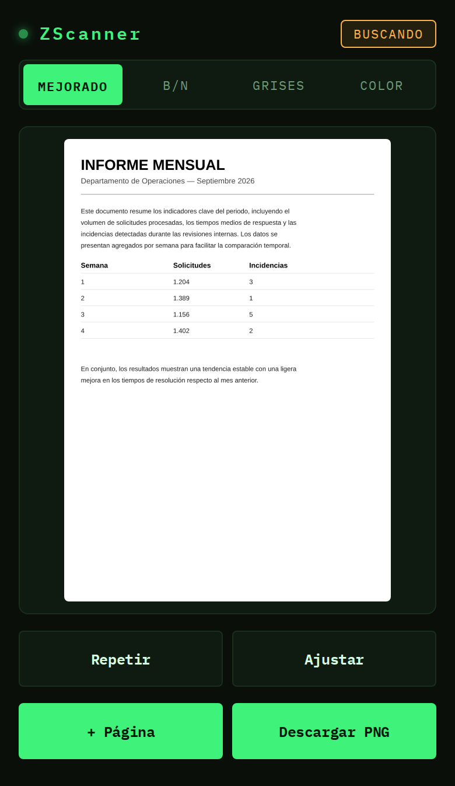

#  ZScanner


Escáner de documentos que corre entero en el navegador: detecta el documento con la
cámara, corrige la perspectiva y exporta un PNG limpio en blanco y negro, escala de
grises o color — o un PDF con varias páginas de una tacada — sin subir nada a ningún
servidor. Toda la visión por computador (detección de bordes, contornos y
`warpPerspective`) la hace [OpenCV.js](https://docs.opencv.org/4.9.0/opencv.js) cargado
por CDN.




Uno más de una serie de proyectos pequeños para portfolio, junto a
[BusYa](https://github.com/rzazo24/busya) (tiempos de paso EMT/CRTM) y
[Disaster Watch](https://github.com/rzazo24/disaster-watch) (alertas globales GDACS).

**Demo en vivo:** https://zscanner.vercel.app/

## Cómo funciona

- Antes de pedir permiso de cámara aparece una pantalla propia explicando para qué hace
  falta ("todo el procesado ocurre en tu navegador, la imagen nunca sale de tu
  dispositivo"). El diálogo nativo de "permitir acceso" del navegador no se puede
  personalizar por seguridad — esta pantalla solo le da contexto antes de que aparezca,
  en vez de que salte de golpe en mitad de una pantalla de carga en blanco.
- La cámara trasera se abre con `getUserMedia` y, en cada frame, un bucle de detección
  corre el documento a través de OpenCV.js: gris → `GaussianBlur` → `Canny` →
  `findContours` → `approxPolyDP`, buscando el cuadrilátero convexo más grande. El
  contorno detectado se dibuja en tiempo real sobre el preview.
- Los umbrales de `Canny` se recalculan en cada frame a partir de la mediana de brillo de
  la imagen (heurística estándar, sigma=0.33), en vez de usar un par de valores fijos —
  así la detección se adapta sola a luz mala o poco contraste en vez de depender de un
  ajuste manual único que solo funciona bien en una escena. Si ese cálculo no encuentra
  ningún cuadrilátero, se reintenta una vez con umbrales más permisivos antes de rendirse
  en ese frame.
- Solo se aceptan cuadriláteros con los 4 ángulos internos razonablemente rectos (con
  margen amplio para tolerar perspectiva pronunciada) — descarta formas degeneradas que
  antes podían "engancharse" a objetos que no son el documento.
- La detección exige varios frames consecutivos con un cuadrilátero similar antes de
  marcarlo como "detectado" (evita que el estado parpadee con ruido puntual), y tolera
  unos cuantos frames sin detección antes de soltar el bloqueo (una mano cruzando el
  encuadre, un poco de desenfoque de movimiento) en vez de perderlo al instante.
- Antes de buscar bordes, cada frame pasa por CLAHE (realce de contraste local por
  zonas) — ayuda mucho en habitaciones con poca luz, donde el documento está ahí pero
  con muy poco contraste, sin amplificar el ruido tanto como una ecualización global.
  Además, un aviso avisa cuando la escena en sí es demasiado oscura para que cualquier
  procesado la arregle ("Poca luz — busca una zona con más luz ambiente").
- La cámara se pide a ~2400×3200 (antes 1280×1706) — la detección en vivo no se entera,
  porque corre sobre una copia reducida a 360px, así que la resolución de captura no
  afecta a la velocidad del escaneo en vivo, solo a la calidad del resultado final. Con
  el documento detectado, el disparador captura directamente a la resolución nativa de
  la cámara (topada en ~2400px de ancho, equivalente a un A4 a 300dpi): recorta con
  `getPerspectiveTransform` + `warpPerspective` usando las 4 esquinas encontradas.
- Si la detección automática falla, o si el resultado no queda bien encuadrado, hay una
  red de seguridad: el botón de encuadre manual (o "Ajustar" ya en el resultado) congela
  el frame y muestra las 4 esquinas como puntos arrastrables para corregirlas a mano
  antes de aplicar la corrección de perspectiva. El punto de partida usa la mejor
  detección disponible aunque no haya llegado a confirmarse como estable, en vez de un
  rectángulo genérico centrado. Al arrastrar una esquina aparece una lupa con mira,
  desplazada para no quedar tapada por el dedo — el problema número uno de cualquier
  interfaz de recorte táctil.
- También se puede elegir una foto ya existente de la galería en vez de usar la cámara
  en vivo — un botón junto al disparador abre el selector de archivos nativo
  (`<input type="file">`). Al no depender de `getUserMedia` ni del bucle de detección,
  es una vía de escaneo completamente independiente de la cámara en vivo: sigue
  funcionando igual aunque haya algún problema puntual con esta última. La imagen
  elegida siempre pasa por el ajuste manual de esquinas (no hay detección automática
  posible sobre una foto ya tomada).
- El resultado se puede ver en cuatro modos, y descargarse como PNG:
  - **Mejorado** (por defecto): aplana la iluminación desigual y sube el contraste sin
    binarizar — el mismo tipo de filtro que el "B&N" de CamScanner, que en realidad no
    es blanco y negro puro, sino gris continuo con fondo blanco limpio y sin el dentado
    de una umbralización dura. Técnica clásica de normalización de fondo: estima la
    iluminación con un desenfoque fuerte, la resta de la imagen original y estira el
    contraste al resultado.
  - **B/N**: umbralización adaptativa (`adaptiveThreshold`, con el tamaño de bloque
    escalado a la resolución real del recorte para no verse ruidoso a resoluciones de
    captura más altas) — blanco y negro puro, máximo contraste, archivo más pequeño.
  - **Grises** y **Color**: sin procesado adicional.
- Se pueden encadenar varias páginas en una misma sesión: el botón "+ Página" del
  resultado la guarda (en el modo de salida que tuviera en ese momento) y vuelve a la
  cámara para la siguiente, con una barra de miniaturas (quitar una página con su ×)
  visible en cualquier pantalla mientras la sesión siga activa. "Finalizar PDF" junta
  todas las páginas guardadas en un único PDF — todas comparten el tamaño de la primera
  página (el resto se encajan sin recortar ni estirar, solo escaladas y centradas) para
  que el documento se vea consistente en vez de cambiar de tamaño entre página y página
  por pequeñas diferencias de recorte — usando [jsPDF](https://github.com/parallax/jsPDF)
  cargado por CDN solo la primera vez que hace falta, no en cada visita.
- Es una PWA instalable en el móvil (icono en pantalla de inicio, pantalla completa sin
  barra del navegador). Un service worker (`sw.js`) cachea el shell estático de la app
  (HTML/CSS/JS/iconos) con estrategia stale-while-revalidate, para que cargue al instante
  y la interfaz funcione sin conexión en visitas repetidas; si detecta una versión nueva
  mientras la app está abierta, muestra un aviso con un botón para recargar en vez de
  hacerlo solo (podría cortar una captura o un arrastre de esquinas en curso).
- El visor de cámara mantiene siempre su tamaño; los botones de debajo se centran en
  el espacio que quede libre hasta un pequeño pie de página con el enlace a este
  repositorio, en vez de quedar pegados justo bajo el visor con un hueco vacío al
  final en pantallas altas.

### Parámetros de detección ajustables

El área mínima del contorno, el tamaño del blur, el epsilon de `approxPolyDP`, y los
frames requeridos para bloquear/soltar la detección, son overridables por query string,
para probar valores distintos sin tocar código. Pasar `cannyLow`/`cannyHigh` explícitos
desactiva el cálculo automático por mediana y fuerza esos valores fijos (o desactívalo a
mano con `autoCanny=0`):

```
index.html?minArea=0.1&cannyLow=40&cannyHigh=120&blur=7&epsilon=0.015&stableFrames=3&missGrace=8
```

Añadiendo `?debug=1` aparece además un panel con sliders para los mismos parámetros,
con el valor aplicándose en vivo al siguiente frame.

## Limitaciones conocidas

- OpenCV.js pesa ~10 MB y se sirve desde un CDN de terceros: el service worker no lo
  cachea a propósito (es cross-origin, y una respuesta opaca no permite distinguir un
  fetch fallido de uno correcto), así que la primera carga en cada dispositivo depende de
  la conexión. Se apoya en la caché HTTP normal del navegador (24h) para las recargas
  siguientes.
- La detección depende de contraste entre el documento y la superficie. CLAHE ayuda
  bastante cuando el problema es *poco contraste con luz suficiente*, pero no hay
  procesado que invente luz que la cámara nunca capturó — con muy poca luz real, sigue
  haciendo falta buscar una zona más iluminada o el ajuste manual de esquinas. No se usa
  el flash del móvil: a la distancia típica de escaneo crea un punto de luz muy intenso
  con caída brusca hacia los bordes en vez de luz uniforme, lo que en la práctica
  empeora la detección (bordes falsos alrededor del propio brillo) en vez de mejorarla
  — se probó y se revirtió, ver [CHANGELOG](CHANGELOG.md).
- La sesión multipágina guarda cada página como un `<canvas>` en memoria (nunca en
  disco ni en el servidor) — funciona bien para el uso típico de escanear un puñado de
  hojas, pero muchas páginas de alta resolución seguidas pueden notarse en RAM en un
  móvil modesto. No hay un límite explícito de páginas ni una barra de progreso durante
  la generación del PDF.

## Posibles mejoras futuras

- **Detección de esquinas por red neuronal en vez de Canny+contornos.** Apps como
  CamScanner ya no usan visión clásica: entrenan una CNN ligera para predecir
  directamente las 4 esquinas, lo que aguanta mucho mejor fondos de bajo contraste o
  escenas con desorden. [DocAligner](https://github.com/DocsaidLab/DocAligner)
  (Apache 2.0) es un proyecto open-source real que hace esto, exportado a ONNX, con
  una demo que corre en el navegador vía `onnxruntime-web`. No es un simple añadido:
  sería un modelo extra que descargar (además de OpenCV.js, no en su lugar), y las
  implementaciones que existen usan un bundler porque el backend WASM rápido de
  `onnxruntime-web` necesita cabeceras `Cross-Origin-Opener-Policy`/
  `Cross-Origin-Embedder-Policy` para `SharedArrayBuffer` (configurables en Vercel sin
  build step, pero no es un CDN-y-listo como OpenCV.js). Si se aborda, mejor como
  modo opt-in (p. ej. `?ml=1`) que conviva con el pipeline clásico, no como reemplazo.

## Stack

- Vanilla HTML/CSS/JS, sin frameworks ni build step. La lógica se separa en módulos ES
  nativos (`js/*.js` con `import`/`export`) que el navegador resuelve directamente, sin
  bundler.
- PWA instalable: `manifest.webmanifest` + `sw.js`.
- Única dependencia de terceros aparte de OpenCV.js: [jsPDF](https://github.com/parallax/jsPDF)
  (CDN, cargado bajo demanda solo al generar un PDF multipágina).
- Pensado para desplegarse como sitio estático en Vercel.

## Estructura

```
zscanner/
├── css/
│   └── styles.css
├── js/
│   ├── dom.js           # referencias a elementos del DOM
│   ├── state.js         # estado mutable compartido entre módulos
│   ├── ui.js             # transiciones entre las 3 pantallas (cámara/ajuste/resultado)
│   ├── camera.js         # getUserMedia y mapeo de coordenadas vídeo → stage
│   ├── detection.js       # pipeline de OpenCV.js + parámetros ajustables
│   ├── adjust.js          # esquinas arrastrables sobre el frame congelado
│   ├── perspective.js      # warpPerspective + modos de salida + descarga
│   ├── pages.js             # sesión multipágina: miniaturas + exportar PDF (jsPDF)
│   └── main.js               # orquestación: carga de OpenCV.js, SW y listeners de botones
├── icons/                  # iconos de la PWA (192/512/512-maskable/apple-touch-icon)
├── index.html
├── favicon.svg
├── manifest.webmanifest
├── sw.js                   # service worker: cachea el shell estático, nunca OpenCV.js
├── LICENSE
├── CHANGELOG.md
└── README.md
```

## Desarrollo local

No requiere instalación de dependencias ni build step. Basta con servir los archivos
estáticos, por ejemplo:

```bash
python3 -m http.server 8000
# o: npx serve .
```

Y abrir `http://localhost:8000` en el navegador. La cámara requiere HTTPS o `localhost`
(la excepción que los navegadores hacen para `getUserMedia` en desarrollo).

## Despliegue en Vercel

Sin configuración de build: Vercel sirve `index.html`, `css/` y `js/` tal cual como
sitio estático.

## Historial de versiones

Ver [CHANGELOG.md](CHANGELOG.md).

## Licencia

Código bajo licencia MIT (ver [LICENSE](LICENSE)). OpenCV.js se carga desde su propio
CDN oficial y se rige por su propia licencia (Apache 2.0).
